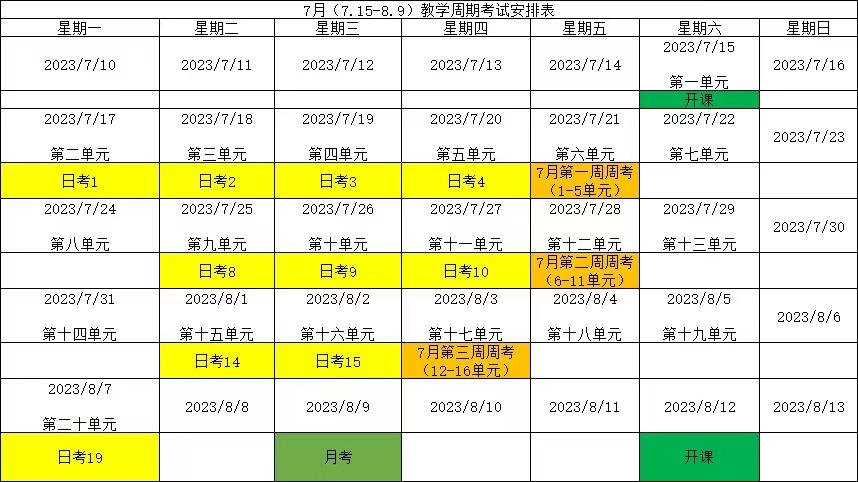
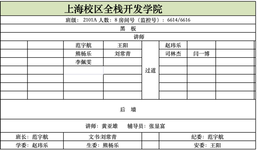

回顾/提问 >>
本课目标 >>
授课/提问 >>
练习/巡视 >>
总结 
---


d2: 
```
  环境：docker、etcd、mysql
  ide go-zero的proto&api插件安装
  sql2pb
  proto文件定义
  微服框架rpc端初始化
  model生成，带缓存/不带缓存
  断点调试,查看model 层的sql执行语句
  .gitignore创建&作用
```

d3:
```
  api文件定义
  微服框架api端初始化
  api分组
  创建公共模块
  公共模块封装返回值
  go work模式
  copier的使用
  列表分页
  加密|加盐
```

d4:
```
  公共模块封装定义生成4为长度的随机数
  sms平台选型，注册账号
  整合sms，配置accesskey等
  公共模块封装推送功能
  短信推送，logic层实现调用
  Cache框架整合&配置
  推送测试
```

-----------------------


d6  
```
  日志分类|分级
  日志输出
  日志配置
  日志记录
  日志压缩
  日期保留天数
  关闭stat报错
  pkg/errors 包引入
  多层级堆栈日志跟踪
  企业级的日志处理流程
```

d7:  
```
  jwt原理
  jwt框架整合
  api端进行分组，一组使用中间件，一组不要
  公共模块封装jwt生成&校验
  JWT业务实现
  使用中间件进行认证拦截
```


d8:  
```
  公共模块封装gorm
  rpc端gorm配置&svc注册
  gorm model层 & sql2gorm
  gorm dao层
  Job里使用Gorm & migration
```

d9:
```
  Gorm使用
  商品模块使用Gorm
  库存模块使用Gorm
  分布式锁 锁定库存
  负载均衡
```


d10 
```
BFF搭建
BFF对外提供服务
BFF聚合后端服务
```

d11
```
ES & kibana 安装
自定义词库
DSL
SDK 整合
ES curd
```


d12
```
单元测试
```

d13
```
CDC 方案对比
go-mysql-transfer
```

d13
```
CDC 方案对比
go-mysql-transfer
```
  